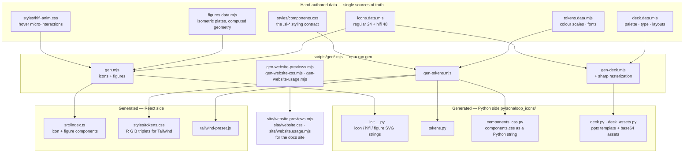
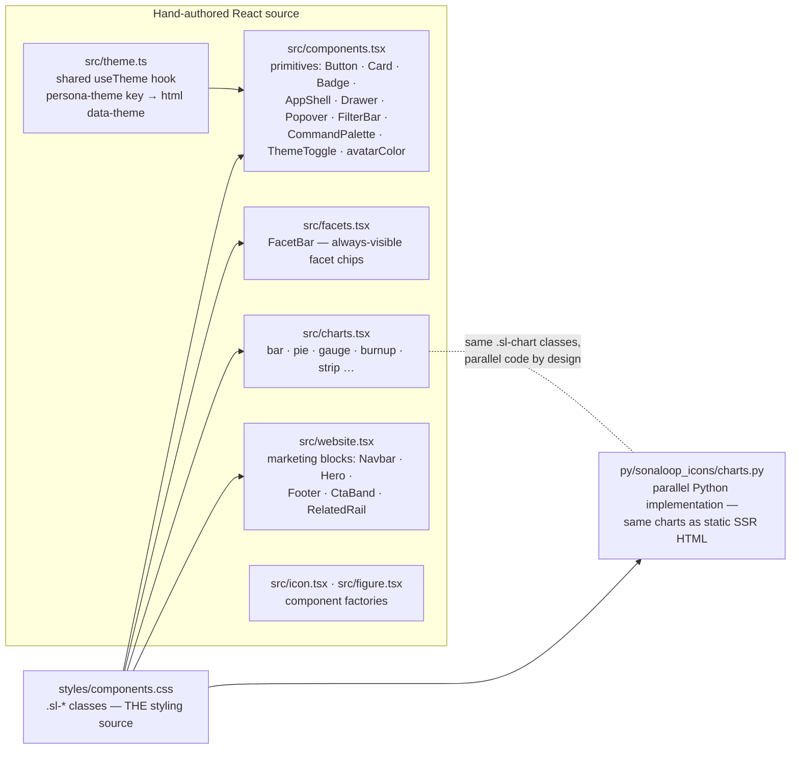
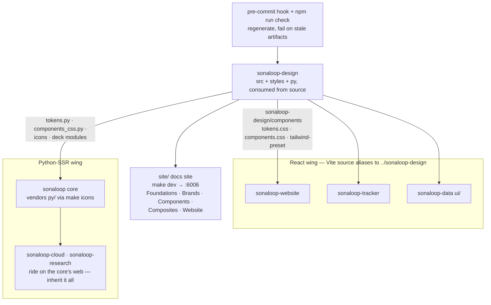

# Architecture

sonaloop-design is the **global design system** for the Sonaloop ecosystem: brand spec
([`BRANDING.md`](BRANDING.md)), design tokens, icons, figures, chart primitives, app/website
components, and the deck template. It serves **two rendering worlds at once** — a React wing
(sonaloop-website, sonaloop-tracker, sonaloop-data's `ui/`) and a Python-SSR wing (the
sonaloop core app, with cloud/research riding on it) — from single sources of truth.

**The core principle: CSS is the one styling source.** `styles/components.css` defines the
`.sl-*` classes; React components and Python SSR helpers both emit those same classes on their
own markup. No component *code* is shared across the stacks — only the class contracts and the
tokens — so the two worlds render identically and cannot drift.

## The codegen pipeline

Everything visual is authored once in hand-written `*.data.mjs` files (plus the hand-authored
CSS and TSX layers) and generated into **both** consumer stacks by `npm run gen`:

Generated files carry a "Do not edit" header — always change the `*.data.mjs` source and
re-run `npm run gen` (or `make gen`).

On top of the generated artifacts sit the **hand-authored layers**:

`src/charts.tsx` and `py/sonaloop_icons/charts.py` are deliberate **parallel
implementations** — both emit self-contained, print-safe markup styled solely by the
`.sl-chart*` classes, so a chart renders identically in the React apps, the Python-SSR app,
and headless-Chromium PDF/PPTX export.

## Consumption

- **React consumers** never install the package — each `vite.config.ts` aliases
  `sonaloop-design` and its subpaths (`/components`, `/components.css`, `/tokens.css`, …)
  straight to this sibling checkout's TypeScript/CSS source.
- **Python consumers**: the core app vendors `py/sonaloop_icons/` (`make icons` in the core
  repo) — tokens, the components CSS string, icons, charts, deck. Cloud and research extend
  the core's web app, so they inherit the design system without touching this repo.
- **Freshness guard**: `npm install` activates `.githooks/pre-commit`
  (via the `prepare` script), which reruns the icon/token generators and re-stages their
  outputs; `npm run check` (`make check`, CI `check.yml`) regenerates everything and fails on
  any diff, so committed artifacts can never go stale.
- **Docs site**: `make dev` regenerates and serves `site/` on `127.0.0.1:6006` — every
  swatch, icon, and component is rendered live from the data sources; the Website section's
  previews are pre-rendered React (`gen-website-previews.mjs`) so the site needs no runtime
  React or Tailwind.

## Modules

| Path | Role |
| --- | --- |
| `tokens.data.mjs` / `icons.data.mjs` / `figures.data.mjs` / `deck.data.mjs` | Hand-authored sources of truth |
| `scripts/gen.mjs` · `gen-tokens.mjs` · `gen-deck.mjs` | Core codegen → React + Python artifacts |
| `scripts/gen-website-*.mjs` | Docs-site prerender of the website blocks |
| `scripts/generate-canvas.mjs` | Light/dark image pairs via gpt-image-1 → `images/canvas/` |
| `src/components.tsx` | React primitives over the `.sl-*` contract; exports `avatarColor` |
| `src/theme.ts` | Shared `useTheme` hook — one theme across all React apps |
| `src/facets.tsx` | `FacetBar` faceted-filtering chips |
| `src/charts.tsx` ⇄ `py/sonaloop_icons/charts.py` | Chart primitives, parallel per stack |
| `src/website.tsx` | Marketing-site blocks (shadcn-style, prop-driven) |
| `src/icon.tsx` · `src/figure.tsx` · `src/images.ts` · `src/films.ts` | Icon/figure factories, curated media registries |
| `styles/components.css` | **The** styling contract (`.sl-*`), shared by both wings |
| `styles/tokens.css` · `tailwind-preset.js` | Generated token CSS + Tailwind preset |
| `styles/hifi-anim.css` · `styles/website.css` · `styles/fonts.css` | Hover animations, website layer, font faces |
| `py/sonaloop_icons/` | The Python package the core app vendors (mostly generated) |
| `site/` · `preview/` | Docs-site chrome (hand-authored) + icon galleries |
| `.githooks/pre-commit` · `.github/workflows/check.yml` | Generated-artifact freshness guards |

## Key seams

- **The `.sl-*` class contract** — the only thing both rendering worlds share. Adding a
  component means: style it in `components.css`, wrap it in `components.tsx`, emit the same
  classes from Python markup.
- **`*.data.mjs` → `npm run gen`** — never edit a generated file; the pre-commit hook and
  `npm run check` enforce this mechanically.
- **Vite alias (React) / `make icons` vendoring (Python)** — how changes propagate: React
  consumers pick them up instantly from source; the core app re-vendors deliberately.
- **`useTheme` + `persona-theme`** — one localStorage key and one `data-theme` attribute
  across every Sonaloop surface, so the theme follows the user between apps.
- **Page-level compositions stay in each app** — the system ships primitives and website
  blocks, not whole pages.
