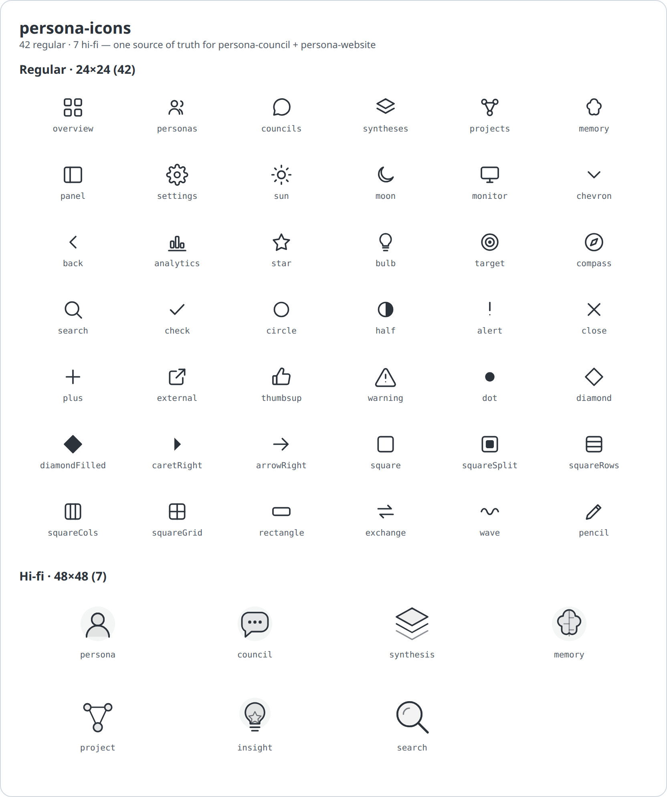

# persona-icons

One icon library, two consumers — the **persona-website** (React) and the
**persona-council** app (Python, server-rendered HTML). Every icon is authored
**once** and generated into both targets, so the two products never drift.

```
icons.data.mjs                  ← author icons here (the only source of truth)
   │  node scripts/gen.mjs
   ├─▶ src/index.ts             ← React/TSX components  (persona-website)
   └─▶ py/persona_icons/__init__.py  ← Python SVG helpers (persona-council)
```

Two flavours, mirroring `bim-icons`:

- **regular** — 24×24, stroke-based, `currentColor`, default strokeWidth 1.75.
  The everyday chrome/UI set.
- **hifi** — 48×48 display icons with fills and a stroke hierarchy
  (2 / 1.5 / 0.75) for hero tiles, feature cards, and empty states.

## All icons



Regenerate this sheet after adding icons: `node scripts/gen-preview.mjs`
(writes `preview/gallery.svg`; rasterize to `preview/gallery.png` for GitHub).

**Regular · 24×24 (42)**

| group | names |
| --- | --- |
| chrome / UI | `overview` `personas` `councils` `syntheses` `projects` `memory` `panel` `settings` `sun` `moon` `monitor` `chevron` `back` `analytics` `star` `bulb` `target` `compass` `search` |
| status & actions | `check` `circle` `half` `alert` `close` `plus` `external` |
| reaction markers | `thumbsup` `warning` `dot` `diamond` `diamondFilled` `caretRight` `arrowRight` |
| research-graph notation | `square` `squareSplit` `squareRows` `squareCols` `squareGrid` `rectangle` `exchange` `wave` `pencil` |

**Hi-fi · 48×48 (7)** — `persona` `council` `synthesis` `memory` `project` `insight` `search`

> Component names are the PascalCase form, e.g. `search` → `SearchIcon`,
> `diamondFilled` → `DiamondFilledIcon`, `persona` (hi-fi) → `PersonaHifi`.

## Adding or editing an icon

1. Edit **`icons.data.mjs`** — add an entry under `regular` or `hifi`:

   ```js
   export const regular = {
     // …
     rocket: {
       label: 'RocketIcon',                 // React export name
       body: '<path d="M5 19l3-3 …"/>',     // inner SVG markup, geometry only
       // cls: 'star',                       // optional extra CSS class (Python side)
     },
   };
   ```

   Keep `body` geometry-only: stroke, size, and linecaps come from the wrapper
   (React) or the host CSS rule `svg.ic` (council). Add an explicit `fill=…`
   on an element only when that element must be filled.

2. Regenerate:

   ```bash
   npm run gen      # or: node scripts/gen.mjs
   ```

3. Commit `icons.data.mjs` **and** the generated `src/index.ts` +
   `py/persona_icons/__init__.py` (consumers read the generated files directly).

> The generated files carry a "Do not edit" header — always change
> `icons.data.mjs` and re-run the generator.

## Using it — React (persona-website)

`persona-website` aliases the package straight to TS source (see its
`vite.config.ts`), exactly like `bim-website → ../bim-icons`:

```ts
import { SearchIcon, PersonaHifi } from 'persona-icons';

<SearchIcon size={18} strokeWidth={1.75} className="text-slate-600" />
<PersonaHifi size={48} />
```

Props: `size`, `strokeWidth`, `absoluteStrokeWidth`, plus any SVG attribute.

## Using it — Python (persona-council)

The council installs the `py/` package as an editable path dependency
(`pyproject.toml` → `[tool.uv.sources] persona-icons = { path = "../persona-icons/py", editable = true }`)
and renders icons to inline SVG strings:

```python
from persona_icons import icon, hifi

icon("search")        # '<svg class="ic" viewBox="0 0 24 24">…</svg>'
icon("star")          # '<svg class="ic star" …>'  (extra class baked in via data)
icon("nope")          # '' for unknown names
hifi("persona", 64)   # self-styled 64px display icon
```

Regular icons emit geometry under `class="ic"`; the council already styles
`svg.ic` (16px, currentColor, strokeWidth 1.75). Hifi icons inline their own
stroke attributes so they render with no extra CSS.

## Status glyphs (council, optional follow-up)

The council still renders a few **typographic** status marks as Unicode
(`✓ ◐ ○ !`, plus the data-driven `present(kind)["glyph"]`, and content emoji
`👍 ⚠`). These are a separate system from the chrome icons — some are drawn
inside SVG `<text>` with font-metric layout coupling — so they were left as-is
during the council cutover. This repo ships `check`, `circle`, `half`, and
`alert` icons ready to migrate that family deliberately when desired.

## Layout

```
icons.data.mjs        source of truth (regular + hifi)
scripts/gen.mjs       generator (zero deps, plain Node)
src/icon.tsx          React factories (personaIcon / personaIconHifi) — hand-written
src/index.ts          GENERATED React barrel
py/persona_icons/     GENERATED Python module + its pyproject.toml
package.json          npm run gen / npm run typecheck
```
